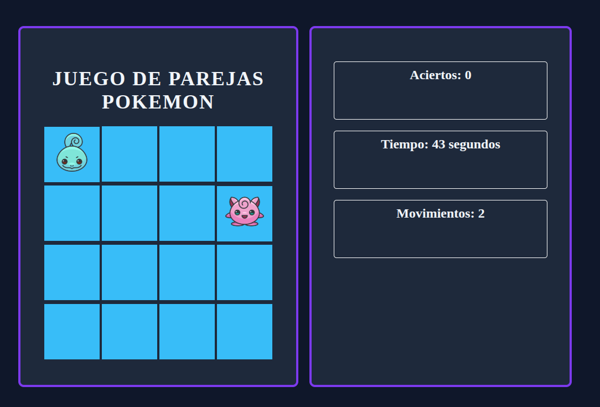

# 🧠 Juego de Parejas Pokémon

¡Un clásico juego de memoria hecho con HTML, CSS y JavaScript!

---

## 🎮 ¿Cómo jugar?

- Haz clic en las cartas para descubrirlas.
- Encuentra las **8 parejas** antes de que el tiempo termine.
- Si ganas, verás un mensaje de victoria y un botón para jugar de nuevo.
- ¡Hay sonidos personalizados para cada acción!

---

## 🚀 Tecnologías utilizadas

---

## 🔊 Funcionalidades

- Mezcla aleatoria de cartas
- Contador de movimientos y aciertos
- Temporizador regresivo
- Sonidos personalizados para click, acierto, fallo, victoria y derrota
- Mensaje visual al ganar o perder
- Botón de reinicio

---

📦 Instalación

Clona el repositorio:
https://github.com/adrianiglesiass/Juego-Parejas.git

